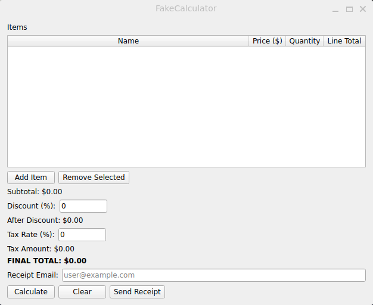

# Novedades

Notas de versión para usuarias y usuarios. Generadas desde `changelog.d/` con
[towncrier](https://towncrier.readthedocs.io/) y pulidas a mano en cada release.

<!-- towncrier release notes start -->

## [1.1.0] - 2026-07-24

### Destacados

- La calculadora ahora tiene **interfaz gráfica de escritorio** — ya no hace falta
  usar la terminal.
- El desglose de precio, descuento e impuestos se actualiza en tiempo real mientras
  editás los valores en la tabla.
- Enviá el recibo por correo electrónico con un solo clic, con validación de email
  integrada.

---

### Novedades

- Interfaz gráfica de escritorio con tabla de ítems, campos de descuento e impuestos,
  y envío de recibos por correo electrónico con validación integrada. ([#3](https://github.com/AxelTroncosoGomez/fake-calculator/pull/3))

---
